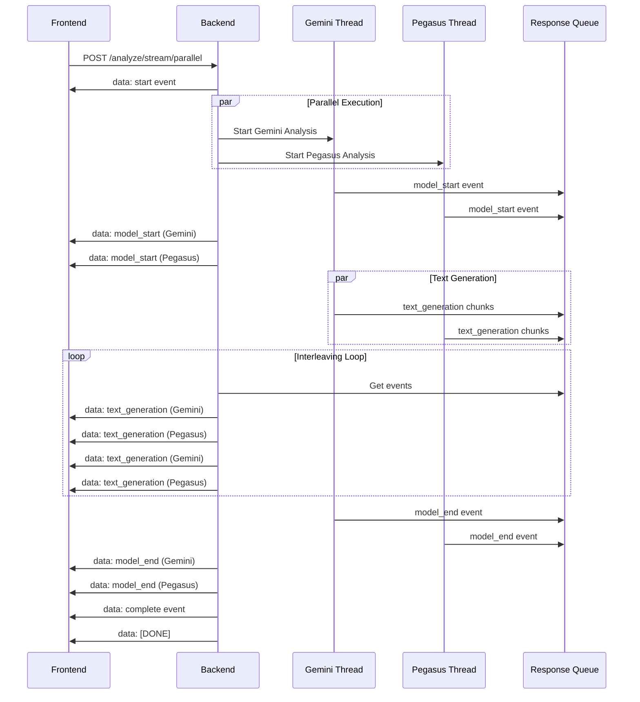

# Parallel Streaming Flowchart

This document shows the complete flow of the `/api/analyze/stream/parallel` endpoint, which enables multiple AI models to analyze videos simultaneously with real-time interleaved streaming.

## Complete Flow Diagram

```mermaid
flowchart TD
    A[Frontend Request] --> B[POST /api/analyze/stream/parallel]
    B --> C{Validate Request}
    
    C -->|Missing params| D[Return Error 400]
    C -->|Valid request| E[Extract Parameters]
    
    E --> F[Query: String]
    E --> G[Models: Array]
    E --> H[Index ID: String]
    E --> I[Video ID: String]
    E --> J[Video Path: String]
    
    J --> K{Video Path Exists?}
    K -->|No| L[Construct from Video ID]
    L --> M[Check File Exists]
    M -->|Not Found| N[Return Error 400]
    M -->|Found| O[Start Parallel Analysis]
    K -->|Yes| O
    
    O --> P[Create Response Queue]
    O --> Q[Initialize Model Tracking]
    
    Q --> R[Active Models Set]
    Q --> S[Model Response Queues]
    Q --> T[Completed Models Set]
    
    O --> U[Send Start Event]
    U --> V[data: start event]
    
    O --> W[Create ThreadPoolExecutor]
    W --> X[Submit Model Tasks]
    
    X --> Y[gemini-2.0-flash Thread]
    X --> Z[pegasus Thread]
    X --> AA[Other Models...]
    
    Y --> BB[Gemini Analysis]
    Z --> CC[Pegasus Analysis]
    
    BB --> DD[Send model_start Event]
    CC --> EE[Send model_start Event]
    
    DD --> FF[Process Video with Gemini]
    EE --> GG[Process Video with Pegasus]
    
    FF --> HH[Generate Response Text]
    GG --> II[Generate Response Text]
    
    HH --> JJ[Chunk Response into Words]
    II --> KK[Chunk Response into Words]
    
    JJ --> LL[Create text_generation Events]
    KK --> MM[Create text_generation Events]
    
    LL --> NN[Add to Response Queue]
    MM --> OO[Add to Response Queue]
    
    NN --> PP[Send model_end Event]
    OO --> QQ[Send model_end Event]
    
    PP --> RR[Add to Response Queue]
    QQ --> SS[Add to Response Queue]
    
    RR --> TT[Mark Gemini Complete]
    SS --> UU[Mark Pegasus Complete]
    
    TT --> VV[Remove from Active Models]
    UU --> WW[Remove from Active Models]
    
    VV --> XX[Add to Completed Models]
    WW --> YY[Add to Completed Models]
    
    XX --> ZZ[Main Streaming Loop]
    YY --> ZZ
    
    ZZ --> AAA{Queue Empty & All Models Complete?}
    AAA -->|No| BBB[Process Queue Events]
    AAA -->|Yes| CCC[Send Complete Event]
    
    BBB --> DDD[Get Event from Queue]
    DDD --> EEE{Event Type?}
    
    EEE -->|text_generation| FFF[Store in Model Queue]
    EEE -->|model_start| GGG[Stream Immediately]
    EEE -->|model_end| HHH[Stream & Update Tracking]
    EEE -->|error| III[Stream & Update Tracking]
    
    FFF --> JJJ[Implement Interleaving]
    GGG --> KKK[Yield Event to Client]
    HHH --> KKK
    III --> KKK
    
    JJJ --> LLL[Round-robin through Models]
    LLL --> MMM[Pop Events from Queues]
    MMM --> NNN[Yield to Client]
    NNN --> OOO[Small Delay for Visibility]
    OOO --> AAA
    
    CCC --> PPP[data: complete event]
    PPP --> QQQ[data: [DONE]]
    QQQ --> RRR[End Stream]
    
    KKK --> AAA
    
    style A fill:#e1f5fe
    style B fill:#f3e5f5
    style O fill:#e8f5e8
    style ZZ fill:#fff3e0
    style RRR fill:#ffebee
    style CCC fill:#e8f5e8
```

## Key Components Explained

### 1. **Request Validation & Setup**
- Validates required parameters (query, models, index_id, video_id, video_path)
- Constructs video path if not provided
- Creates response queue and model tracking structures

### 2. **Parallel Model Execution**
- Uses `ThreadPoolExecutor` to run multiple models simultaneously
- Each model runs in its own thread to avoid blocking
- Models access environment variables directly (no Flask session dependency)

### 3. **Event Generation & Queue Management**
- **Model Start Events**: Sent when each model begins analysis
- **Text Generation Events**: Chunked responses for smooth streaming
- **Model End Events**: Sent when each model completes
- **Error Events**: Sent if any model fails

### 4. **Intelligent Interleaving**
- Stores text generation events in model-specific queues
- Implements round-robin interleaving for fair distribution
- Maintains smooth streaming with small delays between chunks

### 5. **Real-time Streaming**
- Uses Server-Sent Events (SSE) format
- Streams events as they become available
- Provides real-time feedback to frontend

## Event Flow Sequence



## Performance Characteristics

- **Latency**: Models start simultaneously (true parallel)
- **Throughput**: Interleaved responses provide continuous streaming
- **Scalability**: ThreadPoolExecutor handles multiple models efficiently
- **Reliability**: Error handling per model, graceful degradation

## Frontend Integration

The frontend receives Server-Sent Events and can:
- Display real-time progress from multiple models
- Show interleaved responses for better user experience
- Handle model completion independently
- Implement custom UI for different event types 